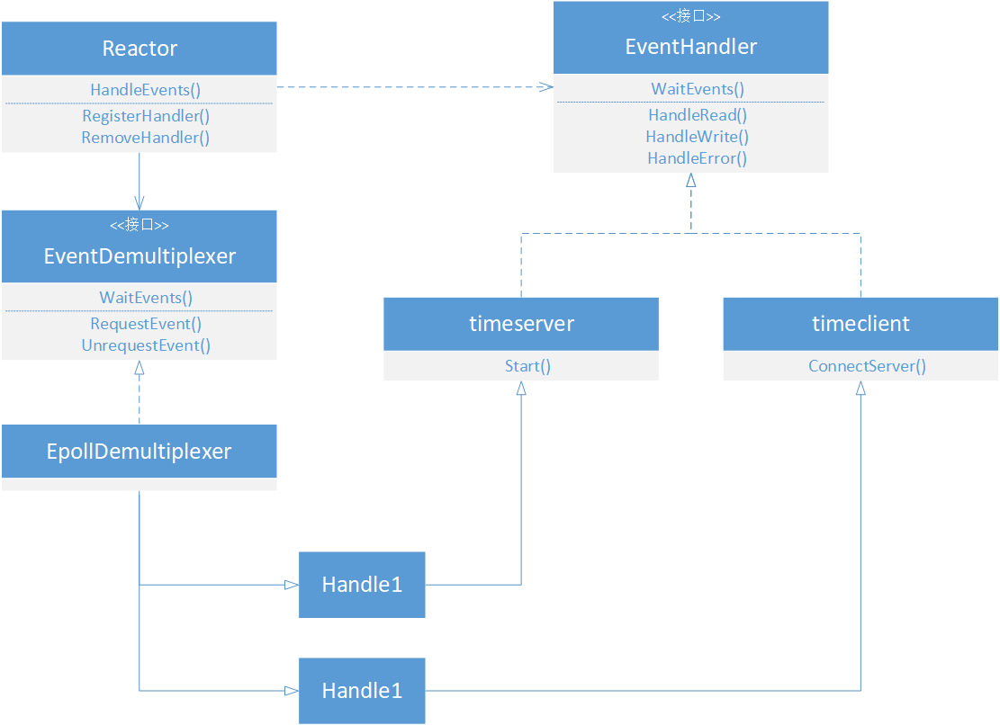

Simple Reactor Implemention Comments
===========================
****
	
|Author|徐昌隆|
|---|---
|E-mail|xclsoftware@163.com

****
### 零、前言
#### 1、SimpleReactorImplemention 介绍
　　SimpleReactorImplemention 是轻量级的以 epoll 技术做为事件分发器的 Reactor 实现框架。
原仓库地址：https://github.com/song0071000/SimpleReactorImplemention
#### 2、本仓库的说明
　　在并发编程领域中，常用的两大设计模式分别是 Reactor 和 Proactor。前者监控的是就绪事件、同步IO，后者监控的是完成事件、异步IO。为了更加详细地了解上述两种模式，选择了该项目进行学习。为了记录我的学习过程，并且也为了和他人分享我的成果，本仓库会保存我对 SimpleReactorImplemention 项目的详细的注释，内容会不断地更新。  
　　如果我的分享能够帮助大家进步，请告诉我，我会非常开心的。😊  
　　感谢 SimpleReactorImplemention 项目作者的开源精神，让我对 Reactor 模式框架原理有了更加深刻的理解，在这里对他表示非常的感谢！
### 一、使用说明
>直接 make，在根目录会生成 “server” 和 “client” 这两个文件，分别运行即可。  
### 二、目录介绍
   * reactor：Reactor 模式核心文件的存储位置。
   * eventhandler：各种事件处理器（包括：server 和 client ）源代码存储位置。
   * eventDemultiplexer：各种事件分配器（包括：select、poll、epoll 和 IOCP）源代码存储位置。
   * obj：目标文件的存放位置。
   * other：其他功能的文件存放位置。
### 三、整体框架

### 四、更新日志
1、2019-10-30
   * 按照 Reactor 模式各个模块整理出目录，分别是 reactor、eventDemultiplexer 和 eventhandler。
   * 完成 makefile 的编写，消除各种编译警告。 
   * 初步完成框架图的编写。

（ 完 ）
